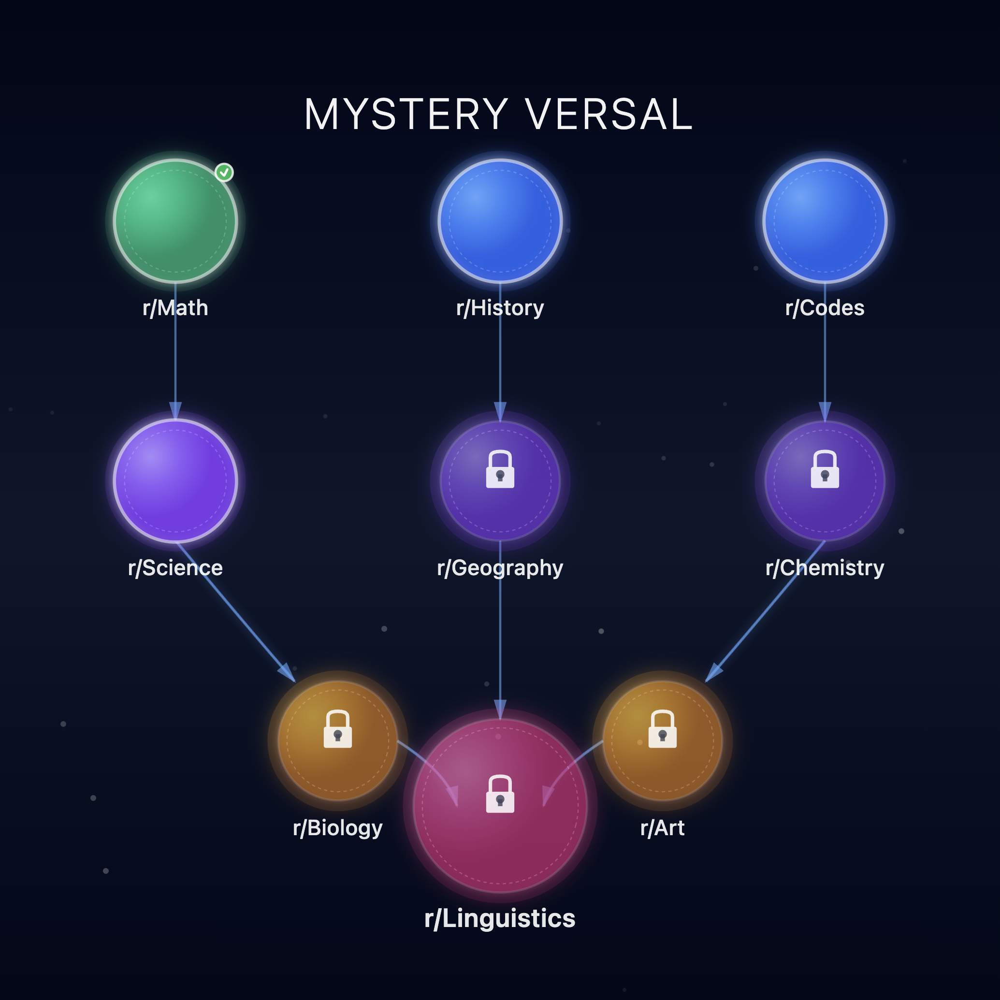

<div align="center">

# **MYSTERY VERSAL**
### *Intelligent Cross-Community Puzzle Hunt Platform*

[](https://developers.reddit.com)
[](https://reactjs.org/)
[](https://www.typescriptlang.org/)
[](https://tailwindcss.com/)

---

<div align="center">
  
</div>

---

**Transform Reddit communities into collaborative puzzle solvers with globally-shared progress and real-time unlocks**

<a href="https://www.reddit.com/r/mystery_versal_dev/comments/1o83iyz/mysteryversal/" target="_blank">
  
</a>

</div>

---

## 🌌 What is Mystery Versal?

**Mystery Versal** is Reddit's first true cross-community collaborative puzzle hunt. Nine challenges span nine subreddits, where progress is globally shared—when one player unlocks a puzzle, everyone benefits.

> *"Nine puzzles, nine communities, one universal truth."*

### ✨ The Magic of Collaboration

- 🧮 Mathematicians decode patterns in r/Math
- ⚗️ Scientists identify elements in r/Chemistry  
- 🏛️ Historians connect events in r/History
- 🔐 Coders crack ciphers in r/Codes
- 🌍 Geographers navigate rivers in r/Geography
- 🧬 Biologists analyze molecules in r/Biology
- 🎨 Artists recognize movements in r/Art
- 🗣️ Linguists solve the final riddle

**Every community contributes. Every solver matters. One shared victory.**

---

## 🎯 Core Features

### 🌍 Global Shared Progress
Unlike traditional games, **everyone plays the same puzzle**. When Player A in Tokyo solves Chemistry, Player B in London instantly sees that tile unlock. True collaboration.

### 🎨 Premium Design
- **Glassmorphism effects** and smooth animations
- **60fps performance** with Framer Motion
- **Mobile-responsive** grid that adapts beautifully
- **Confetti celebrations** on success 🎉

### 🔐 CTF-Quality Puzzles
Each challenge is:
- **Fair but challenging** (no impossible riddles)
- **Google-resistant** (requires thinking, not searching)
- **Community-specific** (leverages domain expertise)

### 🎭 The Meta-Mystery
There's a hidden puzzle within the puzzles. Discover what connects all nine answers—it's an unforgettable revelation.

---

## 🛠️ Tech Stack

<div align="center">

| Layer | Technology |
|:-----:|:----------:|
| **Platform** |  Reddit Native |
| **Frontend** |  +  |
| **Styling** |  |
| **Animation** |  |
| **State** | Redis + React Context |
| **Build** | Vite + Devvit CLI |

</div>

---

## 🚀 Quick Start

```bash
# Clone repository
git clone https://github.com/codedbykishore/mystery-versal.git
cd mystery-versal

# Install dependencies
npm install

# Start development server
npm run dev

# Build and deploy to Devvit
npm run build
devvit upload
```

---

## 🎮 How It Works

**Step 1**: Open the 3×3 puzzle grid  
**Step 2**: Click an unlocked tile (green glow)  
**Step 3**: Solve the challenge in that subreddit  
**Step 4**: Watch your success unlock the next piece for everyone  
**Step 5**: Complete all nine to discover the universal truth

---

## 🏆 What Makes It Special

### Real-Time Collaboration
Watch tiles light up as the global community solves puzzles. Redis-powered synchronization ensures everyone stays connected.

### Community-First Design
Built **by Redditors, for Redditors**. Every puzzle celebrates what makes each subreddit unique.

### No Individual Scores
There are no leaderboards dividing us. Just **one puzzle, one community, one goal**.

---

## 🤝 Join the Hunt

### For Players
- Share hints (not answers!) in r/MysteryVersal
- Celebrate when tiles unlock
- Welcome newcomers to the mystery

### For Developers
- Fork and improve the codebase
- Submit PRs for features/fixes
- Build Season 2 puzzle sets

### For Puzzle Creators
Have an idea? We're always looking for creative challenges. [Submit your puzzle ideas →](https://github.com/codedbykishore/mystery-versal/discussions/new?category=ideas)

---

## 🎓 What We Learned

- **Redis patterns** for global state synchronization
- **Devvit platform** capabilities and limitations
- **CTF puzzle design** that balances challenge and fairness
- **Community dynamics** in collaborative games

---

## 🔮 Roadmap

- [ ] **Season 2** with new themes (Sci-Fi, Ancient Civilizations)
- [ ] **Contributor board** showing first solvers
- [ ] **Hint system** with time-gated reveals
- [ ] **Mobile app** with push notifications
- [ ] **Custom hunts** for subreddit moderators

---

## 📜 License

MIT License - See [LICENSE](LICENSE) for details

---

<div align="center">

### 💬 Connect With Us

**Reddit**: r/MysteryVersal  
**GitHub**: [Mystery Versal](https://github.com/codedbykishore/mystery-versal)  
**Issues**: [Report Bugs](https://github.com/codedbykishore/mystery-versal/issues)

---

**Built with ❤️ for the Reddit community at Devvit Hackathon 2025**

*"Knowledge is power, scattered across many minds, united in purpose."*

[](https://github.com/codedbykishore/mystery-versal)

</div>
